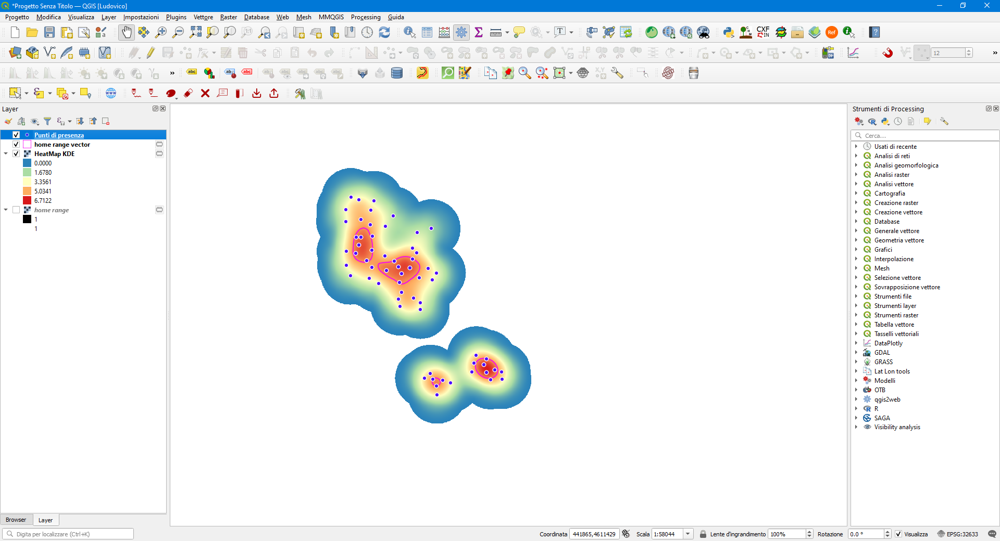

# Home range analysis through Kernel Density Estimation in QGIS

**UPDATE 02/2022 I've developed a model which estimates the home range through the MCP in QGIS [Home Range MCP](https://github.com/ludovico85/Home-range-analysis-Minimum-Convex-Polygon-MCP-QGIS)**

## Description
The model created with the Graphical Model Builder in QGIS 3.16 allows to calculate the home range for a given level of density (typically 50% and 95%) through Kernel Density Estimation. [Kernel Density](https://pro.arcgis.com/en/pro-app/latest/tool-reference/spatial-analyst/how-kernel-density-works.html) is based on the Silverman's rule of Thumb for search radius estimantion (unweighted distance),

where:

- Dm is the median distance from mean center of the points.
- n is the number of points.
- SD is the standard distance.

The min part of the equation means that which ever of the two options that results in a smaller value will be used.

The standard distance is computed as:

where:
- x i , y i and z i are the coordinates for feature i
- {x̄, ȳ, z̄} represents the mean center for the features (if the coordinate z is present)
- n is equal to the total number of features.

## Usage
- Point data source: a point layer file. Please note that for a correct calculation of the home range, point locations must be in a projected reference system (i.e. UTM).
- Cell size: the dimension of the home range raster output. The cell size should be selected according to the extent of the study area, the amount of information, etc.
- % of KDE: percentage for home-range size estimation (typically 95 and 50).
- Smooth parameters: the parameters to be used for the vectorization of the result (see [smooth](https://docs.qgis.org/3.16/en/docs/user_manual/working_with_vector/functions_list.html?highlight=smooth#smooth)).

The model uses QGIS algorithms and works only for QGIS 3.16 (and later versions).

In order to use the model, download the model [Home Range MCP.model3](https://raw.githubusercontent.com/ludovico85/Home-range-analysis-through-Kernel-Density-Estimation-in-QGIS/master/Home%20Range%20KDE.model3) first, then open QGIS, go to the `Processing options`, and select `Open an existing model...` Navigate to the folder containing the model and DONE!

## References

- https://groups.google.com/g/gis-in-ecology-forum/c/-k6fHpJfcRQ?pli=1
- https://desktop.arcgis.com/en/arcmap/10.3/tools/spatial-analyst-toolbox/how-kernel-density-works.htm#:~:text=The%20Kernel%20Density%20tool%20calculates,a%20town%20or%20wildlife%20habitat.
